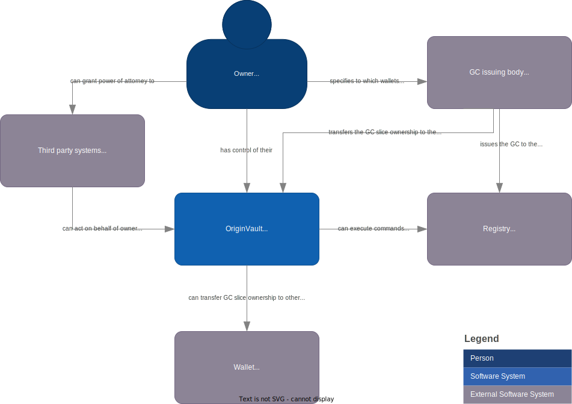

# Project Origin - OriginVault

OpenSource project to create a service which can hold users wallet for managing Granular Certificates across multiple registries.

The name `OriginVault` is a play on words,
where `Origin` links to the project's name, while `Vault` references a banks vault storing many owners assets in a secure manner.

## tl:dr

The OriginVault project aims to provide a service for managing Granular Certificates across multiple registries.
It allows users to store their digital assets in one place and easily transfer ownership to other parties.

The solution involves the introduction of an OriginVault service that can be hosted anywhere,
enabling users to centralize control of their assets.

This service ensures interoperability and simplifies ownership management and cross-border transfers.

## Problem Statement

In the Project-Origin implementation, a Granular Certificates (GCs) and its slices and their lifecycle remains in one single registry,
but each user might hold GC slices in multiple registries.
This was aimed at enhancing system throughput, complicates owner experience, especially concerning ownership management and cross-border transfers.

Ownership of a slice on a registry is proved by being in control of the private-key where the public part is registered on the slice.
For a registry, an ownership transfer is a simple change of public-key.

Users want to be able to have one place (at one service provider) to store all their digital assets (GCs and slices).
They want to interact with the system as a whole, without having the need to understand the underlying infrastructure and architecture.

The users would also want the ability to transfer the ownership of said digital asset to other parties that might be in different countries or having wallets at a different service provider.

Additionally, owners want seamless cross-border ownership, transfers and interactions with varied service providers,
necessitating a solution that transcends geographical and administrative boundaries.

## Context

Users might hold assets that generate GCs in multiple countries, and have been transferred GCs,
which mean their GCs will be split among multiple registries, issuing bodies and service providers.

Any actor could set up an instance of a Project Origin registry.
Registries are not necessarily tied to one exact area (country or bidding zone): A registry can span multiple areas, and multiple registries can exist in one area.

GCs are unable to be moved across registries, and owners must manage their ownership across multiple registries.

## Forces

The business requirement of being able to **transfer ownership cross-border** and **claim across multiple registries**.

There is no centralized identity system between the parties, so no single identity can be used to store ownerships of certificates.

Users should be allowed to be in control of their data, and have the ability to to chose a provider manage to their data.

Actors operating as or on behalf of the state, who issue GCs (e.g. issuing bodies) needs to create or enable services that serve all consumers and producers of energy, not just the digital native.

All parties are underlying EU GDPR and possibly local legislation for privacy issues.

It would not be in the interest of the parties having to create local accounts for owners from another country, when ownership of a GC changes.
Similar banks don't create local accounts when money is transferred to an entity in another country.

Multiple entities want the ability to enable its users to have a wallet, and to be able to interact with the system as a whole.

## Solution

The introduction of an `OriginVault` resolves these challenges by offering a service that can be hosted anywhere.

OriginVault will enable the individual GC slice to always remain in one of the different registries,
while enabling the users to have wallets placed in at a provider or self-hosted.
It will give the users to centralize control of their assets.

Creating this OriginVault enables multiple entities to host wallets for their users, with a minimal amount of effort and ensuring interoperability.

## Sketch

Below is a C4 system diagram of an overview of the system landscape OriginVault is a part of.

## Resulting Context

Users are now able to have access to all their GC slices in one wallet even if they are spread on multiple registries,
issued by different issuers and in different countries.

The OriginVault will be a service that can be hosted by any actor, and will be able to interact with any registry.

Users are also enabled to choose their own wallet provider or host their own.
