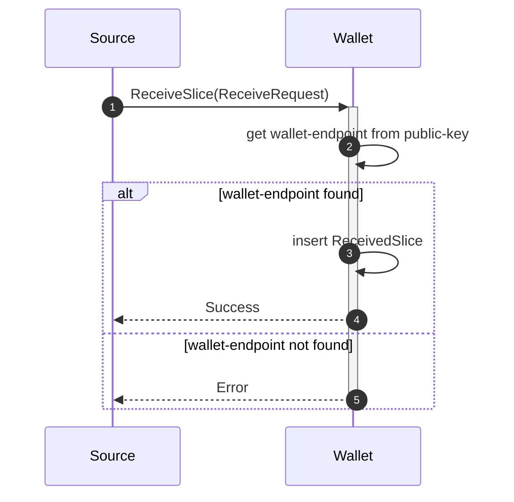
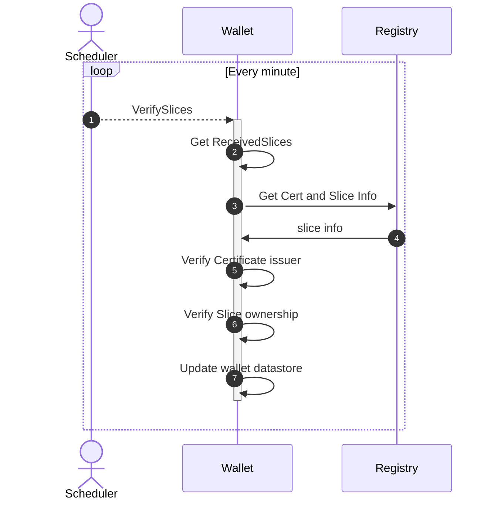

# Slice receive flow

Granular Certificates are "transferred" as slices to the wallet,
the actual slice is on the registry,
the necessary information to prove ownership and act on the slice is transferred.

1. A source sends a slice to a recipient wallet.
2. The wallet will try to look-up the wallet-endpoint based on the public-key.
3. Next the slice is inserted to a pending table, and must later be verified.
4. And finally a success is returned
5. If the wallet-endpoint could not be found then an error is returned.

## Slice verification

When a slice is received, it is stored in the message broker until it is verified.

A background process will then verify and update the state of the slice later.

If the certificate and attributes are unknown, then they will be updated as part of this flow.

