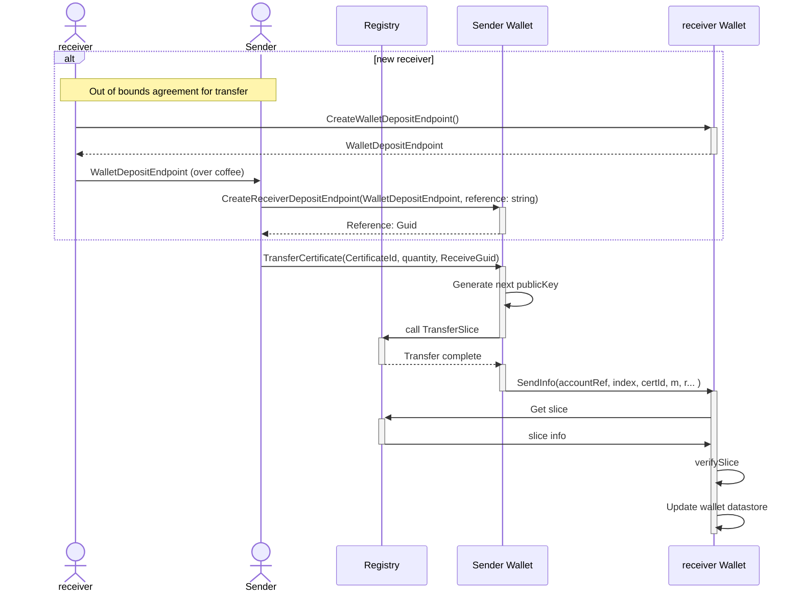

## GC Transfer flow

wallet://mywallet.sdaugaard.dk/?exchangeToken=123515621b35252453

```mermaid
sequenceDiagram
    actor receiver as receiver
    actor sender as Sender
    participant reg as Registry
    participant senderWallet as Sender Wallet
    participant wallet as receiver Wallet

    alt new receiver
        Note over sender,receiver: Out of bounds agreement for transfer

        receiver ->>+ wallet: CreateWalletDepositEndpoint()
        wallet -->>- receiver: WalletDepositEndpoint

        receiver ->> sender: WalletDepositEndpoint (over coffee)

        sender ->>+ senderWallet: CreateReceiverDepositEndpoint(WalletDepositEndpoint, reference: string)

        senderWallet -->>- sender: Reference: Guid
    end

    sender ->> senderWallet: TransferCertificate(CertificateId, quantity, ReceiveGuid)

    activate senderWallet
    senderWallet ->> senderWallet: Generate next publicKey
    senderWallet ->> reg: call TransferSlice
    deactivate senderWallet

    activate reg
    reg -->> senderWallet: Transfer complete
    deactivate reg

    activate senderWallet
    senderWallet->> wallet: SendInfo(accountRef, index, certId, m, r... )
    deactivate senderWallet

    activate wallet
    wallet ->>+ reg: Get slice
    reg ->>- wallet: slice info
    wallet ->> wallet: verifySlice
    wallet ->> wallet: Update wallet datastore
    deactivate wallet
```
