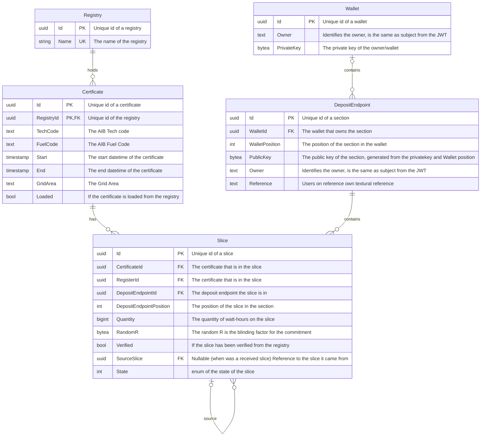

```mermaid
erDiagram

    Wallet {
        uuid Id PK "Unique id of a wallet"
        text Owner "Identifies the owner, is the same as subject from the JWT"
        bytea PrivateKey "The private key of the owner/wallet"
    }

    Wallet |o--o{ DepositEndpoint : contains

    Certficate {
        uuid Id PK "Unique id of a certificate"
        uuid RegistryId PK,FK "Unique id of the registry"
        text TechCode "The AIB Tech code"
        text FuelCode "The AIB Fuel Code"
        timestamp Start "The start datetime of the certificate"
        timestamp End "The end datetime of the certificate"
        text GridArea "The Grid Area"
        bool Loaded "If the certificate is loaded from the registry"
    }

    Certficate ||--o{ Slice : has

    DepositEndpoint {
        uuid Id PK "Unique id of a section"
        uuid WalletId FK "The wallet that owns the section"
        int WalletPosition "The position of the section in the wallet"
        bytea PublicKey "The public key of the section, generated from the privatekey and Wallet position"
        text Owner "Identifies the owner, is the same as subject from the JWT"
        text Reference "Users on reference own textural reference"
    }

    Slice |o--o{ Slice : source


    Slice {
        uuid Id PK "Unique id of a slice"
        uuid CertificateId FK "The certificate that is in the slice"
        uuid RegisterId FK "The certificate that is in the slice"
        uuid DepositEndpointId FK "The deposit endpoint the slice is in"
        int DepositEndpointPosition "The position of the slice in the section"
        bigint Quantity "The quantity of watt-hours on the slice"
        bytea RandomR "The random R is the blinding factor for the commitment"
        bool Verified "If the slice has been verified from the registry"
        uuid SourceSlice FK "Nullable (when was a received slice) Reference to the slice it came from"
        int State "enum of the state of the slice"
    }

    DepositEndpoint ||--o{ Slice : contains
    Registry ||--o{ Certficate : holds

    Registry {
        uuid Id PK "Unique id of a registry"
        string Name UK "The name of the registry"
    }

```
