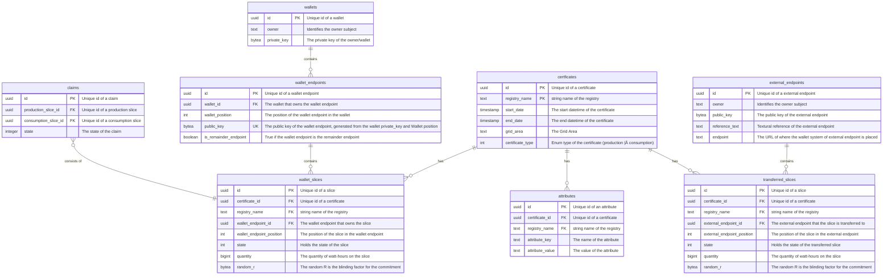

```mermaid
erDiagram

    claims }o--|| wallet_slices : "consists of"
    claims {
        uuid id PK "Unique id of a claim"
        uuid production_slice_id FK "Unique id of a production slice"
        uuid consumption_slice_id FK "Unique id of a consumption slice"
        integer state "The state of the claim"
    }

    wallets {
        uuid id PK "Unique id of a wallet"
        text owner "Identifies the owner subject"
        bytea private_key "The private key of the owner/wallet"
    }

    wallets ||--o{ wallet_endpoints : contains
    wallet_endpoints {
        uuid id PK "Unique id of a wallet endpoint"
        uuid wallet_id FK "The wallet that owns the wallet endpoint"
        int wallet_position "The position of the wallet endpoint in the wallet"
        bytea public_key UK "The public key of the wallet endpoint, generated from the wallet private_key and Wallet position"
        boolean is_remainder_endpoint "True if the wallet endpoint is the remainder endpoint"
    }

    certficates {
        uuid id PK "Unique id of a certificate"
        text registry_name PK "string name of the registry"
        timestamp start_date "The start datetime of the certificate"
        timestamp end_date "The end datetime of the certificate"
        text grid_area "The Grid Area"
        int certificate_type "Enum type of the certificate (production | consumption)"
    }

    certficates ||--o{ wallet_slices : has
    wallet_endpoints ||--o{ wallet_slices : contains
    wallet_slices {
        uuid id PK "Unique id of a slice"
        uuid certificate_id FK "Unique id of a certificate"
        text registry_name FK "string name of the registry"
        uuid wallet_endpoint_id FK "The wallet endpoint that owns the slice"
        int wallet_endpoint_position "The position of the slice in the wallet endpoint"
        int state "Holds the state of the slice"
        bigint quantity "The quantity of watt-hours on the slice"
        bytea random_r "The random R is the blinding factor for the commitment"
    }

    certficates ||--o{ attributes : has
    attributes {
        uuid id PK "Unique id of an attribute"
        uuid certificate_id FK "Unique id of a certificate"
        text registry_name FK "string name of the registry"
        text attribute_key "The name of the attribute"
        text attribute_value "The value of the attribute"
    }

    external_endpoints {
        uuid id PK "Unique id of a external endpoint"
        text owner "Identifies the owner subject"
        bytea public_key "The public key of the external endpoint"
        text reference_text "Textural reference of the external endpoint"
        text endpoint "The URL of where the wallet system of external endpoint is placed"
    }

    certficates ||--o{ transferred_slices : has
    external_endpoints ||--o{ transferred_slices : contains
    transferred_slices {
        uuid id PK "Unique id of a slice"
        uuid certificate_id FK "Unique id of a certificate"
        text registry_name FK "string name of the registry"
        uuid external_endpoint_id FK "The external endpoint that the slice is transferred to"
        int external_endpoint_position "The position of the slice in the external endpoint"
        int state "Holds the state of the transferred slice"
        bigint quantity "The quantity of watt-hours on the slice"
        bytea random_r "The random R is the blinding factor for the commitment"
    }
```
