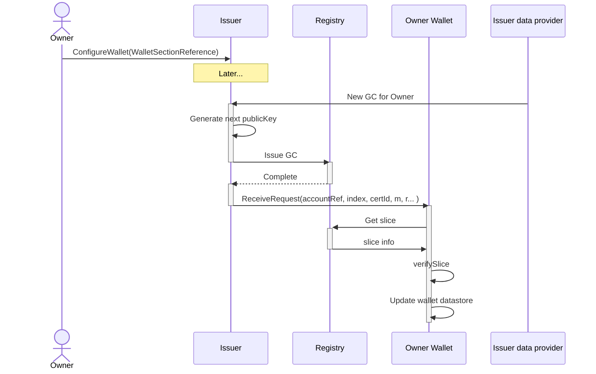

# GC issuance flow

In the issuance flow, the owner of the asset configures the Issuer with a WalletSectionReference which contains.

The Issuer can here generate new public keys in series, so no extra call to the wallet to get an public key is needed.
But, if the Owner has multiple issuers, he must give a different walletSection to each issuer, as to ensure the same key is not used multiple times.

