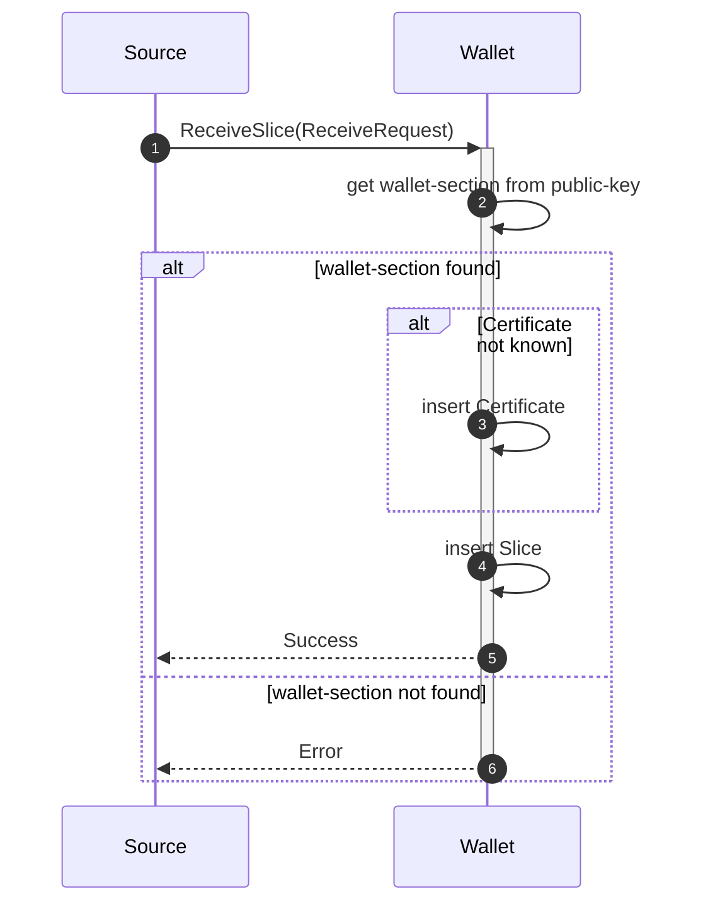
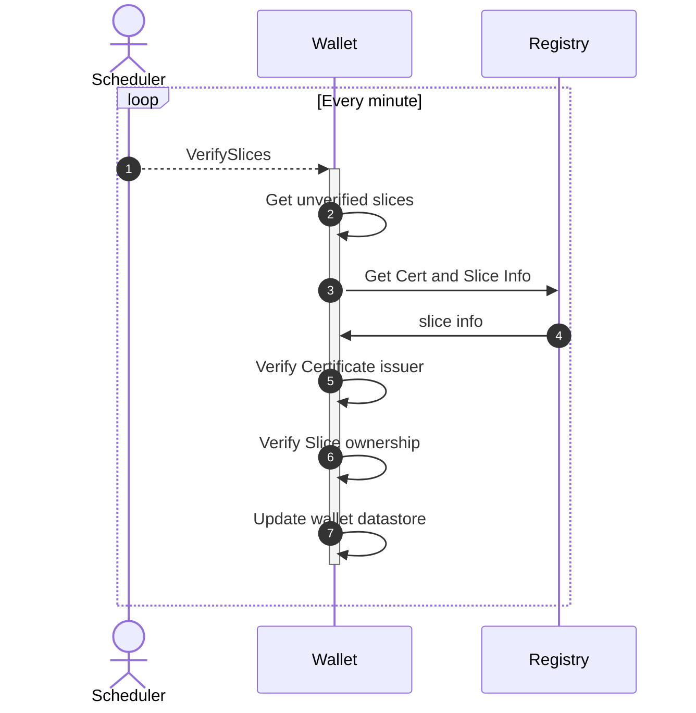

# Slice receive flow

Granular Certificates are "transferred" as slices to the wallet,
the actual slice is on the registry,
the necessary information to prove ownership and act on the slice is transferred.

1. A source sends a slice to a recipient wallet.
2. The wallet will try to look-up the wallet-section based on the public-key.
3. If the certificate is not already known by the wallet, then a reference to the certificate is inserted into the datastore
4. Next the slice itself is inserted with reference to the wallet-section and certificate
5. And finally a success is returned
6. If the wallet-section could not be found then an error is returned.

## Slice verification

> **Warning**
> Not yet implemented

When a slice is received, it is stored in the data-store as non-verified.

A background process will then verify and update the state of the slice later. If the certificate and attributes are unknown, then they will be updated as part of this flow.

