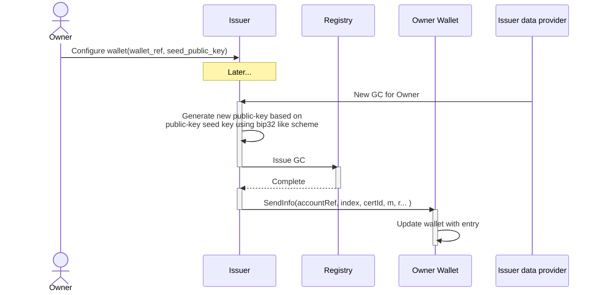
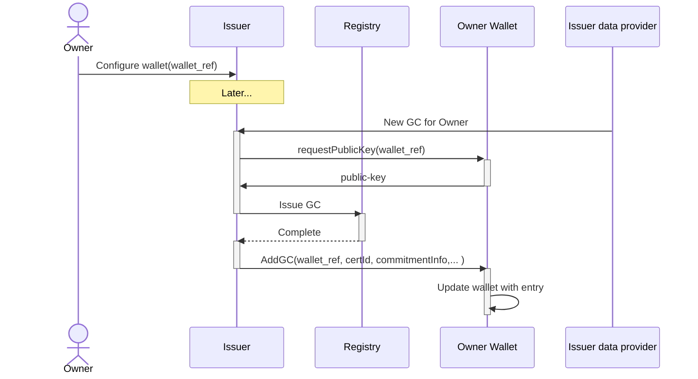

# GC issuance flow

Below is outline of two solutions to handle issuance flows.

## Seed solution

Here the issuer is given a reference the the owner wallet, and a seed_public_key.

The Issuer can here generate new public keys in series, so no extra call to the wallet to get an public key is needed.
But, if the Owner has multiple issuers, he must give a different account(BIP44 like) to each issuer, as to ensure the same
key is not used multiple times.

## Request solution

Here the issuer is only given a reference the the owner wallet.

The issuer will then request the wallet for a public-key to which to issue a GC.
This results in more requests, these could be bundled, and could result in the wallet reserving keys that never end up being used.

