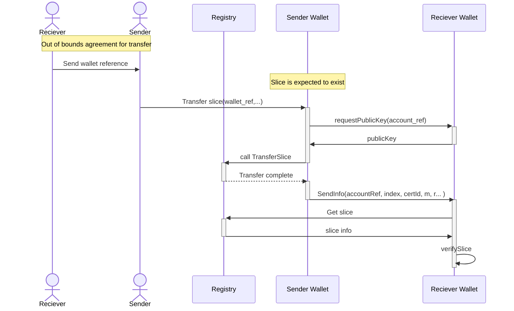
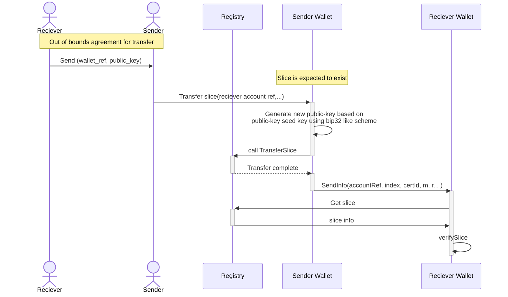

## Transfer 

Below is an preliminary example flow of a transfer from one owner to another.

```mermaid

sequenceDiagram
    actor reciever as Reciever
    actor sender as Sender
    participant reg as Registry
    participant senderWallet as Sender Wallet
    participant recieverWallet as Reciever Wallet


    Note over sender,reciever: Out of bounds agreement for transfer
    reciever ->> sender: Send wallet reference
    Note over senderWallet: Slice is expected to exist

    sender ->>+ senderWallet: Transfer slice(wallet_ref,...)


    senderWallet ->>+ recieverWallet: requestPublicKey(account_ref)
    recieverWallet ->>- senderWallet: publicKey

    senderWallet ->> reg: call TransferSlice
    deactivate senderWallet
    activate reg


    reg -->>- senderWallet: Transfer complete
    activate senderWallet

    senderWallet->> recieverWallet: SendInfo(accountRef, index, certId, m, r... )
    deactivate senderWallet
    activate recieverWallet

    recieverWallet ->>+ reg: Get slice
    reg ->>- recieverWallet: slice info
    recieverWallet ->> recieverWallet: verifySlice
    deactivate recieverWallet

```

## Type 2

```mermaid

sequenceDiagram
    actor reciever as Reciever
    actor sender as Sender
    participant reg as Registry
    participant senderWallet as Sender Wallet
    participant recieverWallet as Reciever Wallet


    Note over sender,reciever: Out of bounds agreement for transfer
    reciever ->> sender: Send (wallet_ref, public_key) 
    Note over senderWallet: Slice is expected to exist

    sender ->>+ senderWallet: Transfer slice(reciever account ref,...)

    senderWallet ->> senderWallet: Generate new public-key based on<br>public-key seed key using bip32 like scheme

    senderWallet ->> reg: call TransferSlice
    deactivate senderWallet
    activate reg


    reg -->>- senderWallet: Transfer complete
    activate senderWallet

    senderWallet->> recieverWallet: SendInfo(accountRef, index, certId, m, r... )
    deactivate senderWallet
    activate recieverWallet

    recieverWallet ->>+ reg: Get slice
    reg ->>- recieverWallet: slice info
    recieverWallet ->> recieverWallet: verifySlice
    deactivate recieverWallet

```